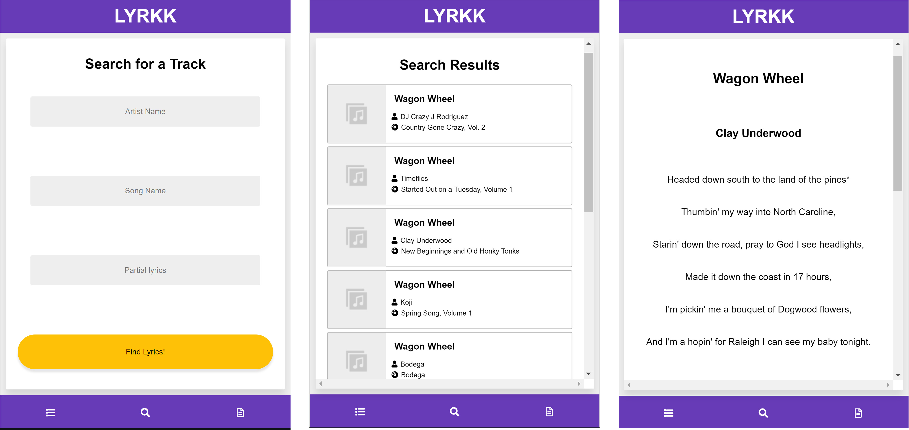

# LYRKK

A simple pocket companion for finding the lyrics to your favorite songs.

## Overview

LYRKK is designed to be as simple as possible, so you can focus on what you're looking for; the lyrics;  LYRKK sources all of its lyrics information from the [MusixMatch API](http://developer.musixmatch.com)

LYRKK is built using React, and bootstrapped using Create-React-App.  All styling and design is vanilla CSS.

## Installation

You can access LYRKK [**here**](https://lyrkk.netlify.com).  You can either use it as a standalone web app, or install it to your device by adding it to the home screen as a web app.

## Usage

Enter data into some, or all of the inputs on the search page - LYRKK will use all of these in its search query.  You will then be presented with a list of the results LYRKK has received from the API - select any of these to see the lyrics for that track.  Use the nav buttons at the bottom of the screen at any point to navigate the app.

You will notice that only 30% of the lyrics are actually shown by LYRKK - this is because the app is a proof of concept, and the API only returns 30% of the lyrics for free-tier requests.  If you would like to help turn LYRKK into a fully featured lyrical platform, [get in touch](mailto:matt@mattchapman.io)